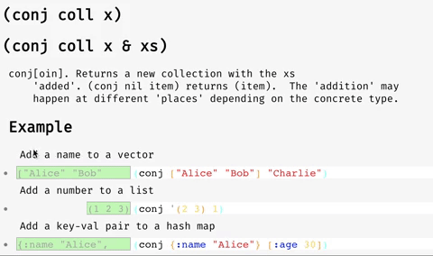

## Introduction

This is not your father's documentation generator. Dynadoc is all about making better documentation by combining Clojure's incredible dynamism with my inability to come up with good project names.

* See the dynadocs for play-cljs, a ClojureScript game library:
  *  https://oakes.github.io/play-cljs/
* See the example projects for tips on how to set up Dynadoc:
  *  https://github.com/oakes/dynadoc-examples

### Instant docs for all Clojure(Script) dependencies

Dynadoc finds all of your Clojure/ClojureScript dependencies and makes a single searchable documentation page for all of them. It's meant to be a general dev tool, not just a static generator for library authors.

### Interactive examples for any Clojure(Script) function

Dynadoc allows you to interact with functions directly on their documentation page. All you have to do is define code examples using a special macro called [defexample](https://github.com/oakes/defexample) and Dynadoc will display them along with little browser-based editors.

ClojureScript examples are particularly cool. They can optionally ask for a DOM element to interact with, allowing for all sorts of visual code examples.

I think I accidentally combined [Codox](https://github.com/weavejester/codox) with [Devcards](https://github.com/bhauman/devcards) and now I'm just rolling with it.

### Export static docs that still have ClojureScript interactivity

While Dynadoc is primarily meant for being run locally, it fully supports exporting to a static site so you can put your docs online. Just click the export link on the top right of any page.

The crazy part is that the interactive ClojureScript examples will still work, because ClojureScript can compile itself in the browser! Check out the [play-cljs dynadocs](https://oakes.github.io/play-cljs/) to see this in action.

## Usage

Please see [the example projects](https://github.com/oakes/dynadoc-examples) for guidance on how to use Dynadoc. I'll write better docs on this when I get the chance (yes...I do see the irony).

## Licensing

All files that originate from this project are dedicated to the public domain. I would love pull requests, and will assume that they are also dedicated to the public domain.
